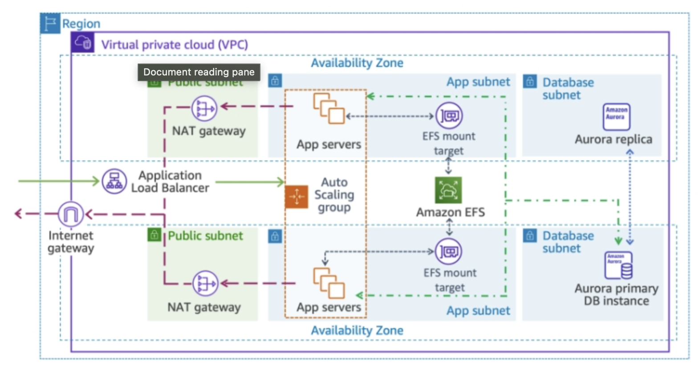

## -DRAFT-

## Dies ist ein Projekt in der IaC in Pulumi und Python für die Azure Cloud.

Ziel ist folgende Architektur:

## Die Struktur des Projektes ist folgendermaßen aufgebaut:

My Azure Cloud with Pulumi 
├── Stack dev
│  ├── RG: dev-network  
│  │     ├── VNet  
│  │     ├── Subnets  
│  │     ├── Public IPs, Load Balancers  
│  ├── RG: dev-app  
│  │     ├── VMs  
│  │     ├── App Services  
│  │     ├── Databases  
├──Stack staging
│  ├── RG: stage-network  
│  ├── RG: stage-app  
├──Stack prod
│  ├── RG: prod-network  
│  ├── RG: prod-app  

## Arbeiten mit dem Projekt:

- read SubId:
- Create ResourceGroups:
  - 
  - 
- Build: Pulumi up

### Notizen:

az group create --name MyResourceGroup --location germanywestcentral # francecentral
pulumi import azure-native:resources:ResourceGroup myResourceGroup /subscriptions/{subId}/resourceGroups/MyResourceGroup

-

pulumi login s3://my-bucket
pulumi login azblob://my-container
pulumi config set databasePassword mySuperSecretPassword --secret

pulumi stack init dev
pulumi stack init staging
pulumi stack init prod
pulumi stack ls
pulumi stack select dev
pulumi stack select staging
pulumi stack select prod

pulumi preview
pulumi up --yes
pulumi destroy --yes

pulumi stack rm dev

-
